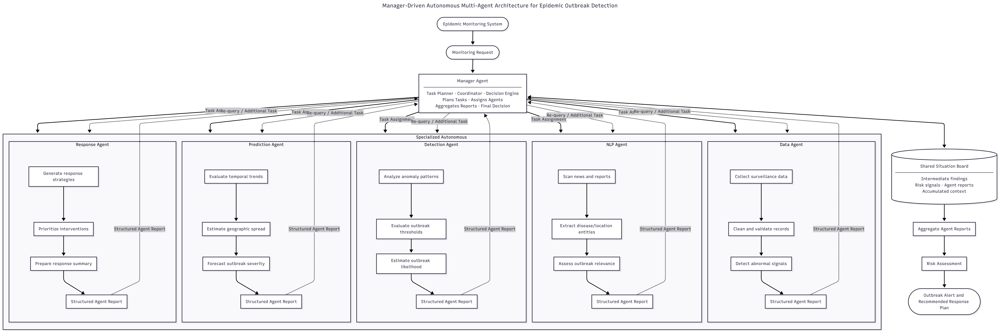

# EpiAgent: Autonomous AI for Disease Outbreak Detection

## Overview
EpiAgent is an Agentic AI system designed to detect potential disease outbreaks early by continuously analyzing multiple health-related data sources.

The system collects information from health databases, clinical reports, environmental data, and digital signals such as news and social media. Using Natural Language Processing and Machine Learning techniques, the AI detects abnormal disease patterns and predicts possible outbreak risks.

When a potential outbreak is detected, the agent evaluates the severity and predicts how the disease may spread. Based on this analysis, the system recommends response strategies such as vaccine planning, resource allocation, and containment measures.

The goal of EpiAgent is to provide early warning alerts and decision support for health authorities.

## System Architecture

## Workflow Diagram

