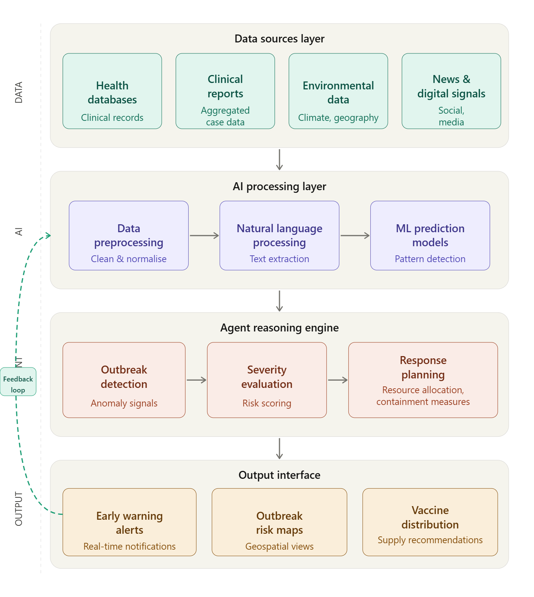

# EpiAgent: Autonomous AI for Disease Outbreak Detection

## Overview

EpiAgent is an Agentic AI system designed to detect potential disease outbreaks at an early stage by continuously analyzing multiple health-related data sources.

The system gathers information from public health databases, clinical reports, environmental data, and digital signals such as news and social media. Using Natural Language Processing (NLP) and Machine Learning (ML) techniques, the system identifies abnormal disease patterns and evaluates potential outbreak risks.

When a possible outbreak is detected, EpiAgent analyzes the severity of the situation and predicts how the disease may spread across regions. Based on this analysis, the system recommends response strategies such as vaccine planning, healthcare resource allocation, and containment measures.

The goal of EpiAgent is to provide early warning alerts and intelligent decision support for public health authorities, enabling faster and more effective responses to emerging health threats.

## System Architecture

## Workflow Diagram

## How to Run the Prototype

1. Install Python 3
2. Install required libraries

pip install pandas numpy

3. Run the prototype

python epiagent_agent.py

The script will simulate the EpiAgent workflow including data ingestion, anomaly detection, outbreak decision logic, and response recommendations.
